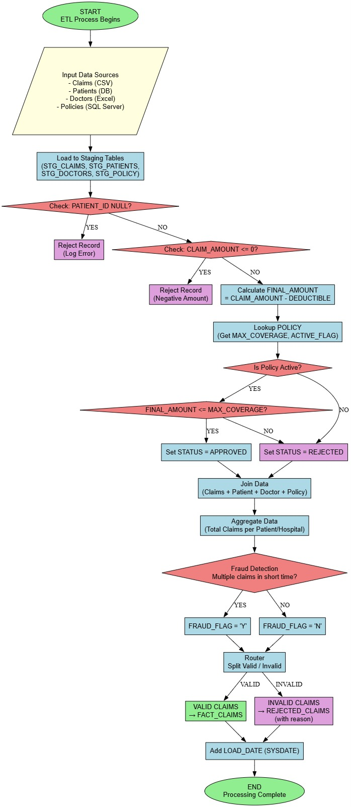
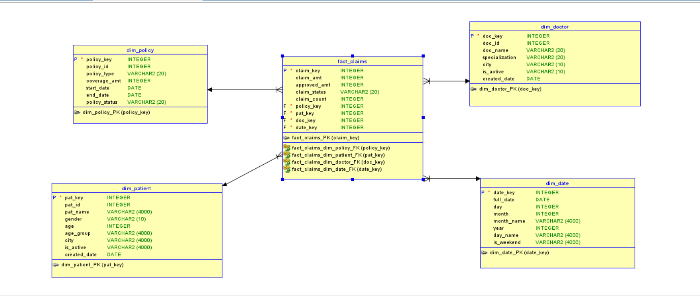
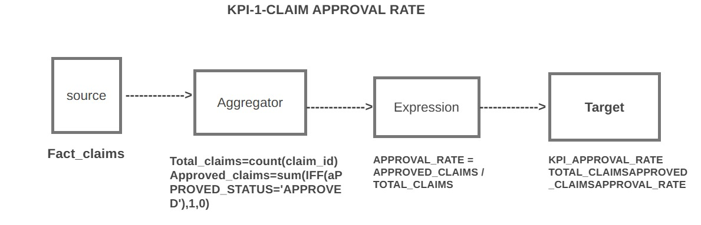
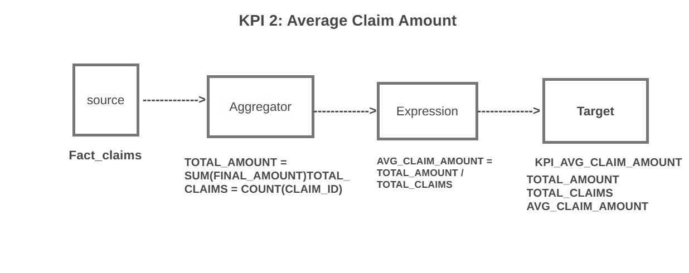
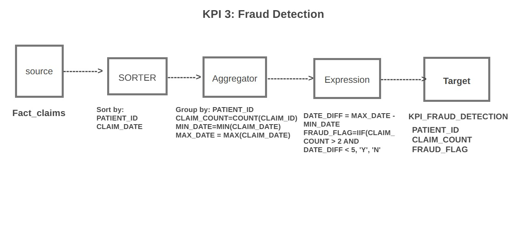
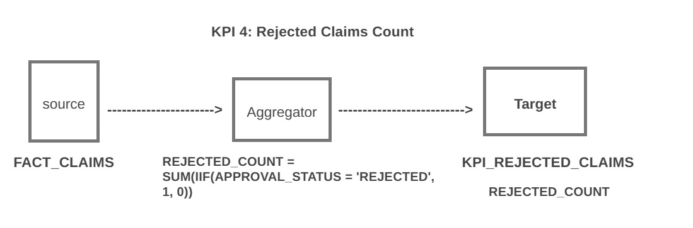

# Healthcare Claims Data Warehouse & Fraud Detection

An end-to-end **ETL and Data Warehousing project** for integrating, validating, transforming, and analyzing healthcare insurance claims data. The project combines claims, patient, doctor, and insurance policy information from multiple sources, applies business rules for claim processing, performs rule-based fraud detection, and generates analytical KPIs.

---

## 📌 Project Overview

Healthcare insurance organizations receive large amounts of claims data from different systems and formats. Raw data can contain missing values, invalid claim amounts, inactive policies, and claims exceeding policy coverage.

This project addresses these challenges by building an **ETL-based Healthcare Claims Data Warehouse**.

The solution:

* Integrates data from multiple heterogeneous sources
* Loads data into staging tables
* Performs data-quality validation
* Applies business rules and transformations
* Validates insurance policies and claim coverage
* Classifies claims as Approved or Rejected
* Detects potentially suspicious claim patterns
* Loads processed data into a Star Schema
* Generates business KPIs for analytical reporting

---

## 🎯 Objectives

1. Integrate healthcare data from multiple sources.
2. Improve data quality through validation and transformation.
3. Automate claim approval and rejection based on business rules.
4. Identify potentially fraudulent claim patterns.
5. Build a structured dimensional data warehouse.
6. Generate KPIs for healthcare insurance analysis.

---

## 🏗️ Project Architecture

The overall ETL workflow follows:

```text
CSV / Database / Excel / SQL Server
                |
                v
         Data Extraction
                |
                v
          Staging Tables
                |
                v
       Data Quality Checks
                |
                v
       Data Transformations
                |
                v
          Policy Lookup
                |
                v
      Approval / Rejection
                |
                v
        Fraud Detection
                |
                v
       Valid / Invalid Route
            /        \
           v          v
   FACT_CLAIMS    REJECTED_CLAIMS
           |
           v
        KPI Layer
           |
           v
     Analytical Reporting
```

### ETL Flowchart



---

## 📊 Data Sources

The project integrates data from different source formats:

| Source     | Data               |
| ---------- | ------------------ |
| CSV        | Claims             |
| Database   | Patients           |
| Excel      | Doctors            |
| SQL Server | Insurance Policies |

This demonstrates practical **heterogeneous data integration** in an ETL environment.

---

## 🔄 ETL Process

### 1. Extract

Data is extracted from claims files, patient databases, doctor Excel files, and insurance policy data.

### 2. Stage

Raw data is loaded into staging structures before further processing.

Example staging tables:

```text
STG_CLAIMS
STG_PATIENTS
STG_DOCTORS
STG_POLICY
```

### 3. Validate

The pipeline performs data-quality checks such as:

* Missing Patient ID
* Invalid or negative Claim Amount
* Inactive Insurance Policy
* Claim Amount exceeding Policy Coverage

Invalid records are routed to the rejection process.

### 4. Transform

For valid claims, the final claim amount is calculated:

```text
FINAL_AMOUNT = CLAIM_AMOUNT - DEDUCTIBLE
```

The transformed value is then used for policy coverage validation.

### 5. Policy Validation

The insurance policy is checked to determine whether it is active and whether the final claim amount is within the allowed coverage.

```text
FINAL_AMOUNT <= MAX_COVERAGE
```

Based on the validation:

```text
APPROVED
    or
REJECTED
```

### 6. Fraud Detection

The project implements rule-based fraud screening by analyzing claims at the patient level.

Claims are grouped using:

```text
PATIENT_ID
CLAIM_DATE
```

The system evaluates claim frequency and the time period between claims.

A potentially suspicious pattern is identified when:

```text
CLAIM_COUNT > 2
AND
DATE_DIFF < 5 DAYS
```

The resulting flag is:

```text
FRAUD_FLAG = 'Y'
```

or:

```text
FRAUD_FLAG = 'N'
```

> **Note:** This is a rule-based fraud detection mechanism designed to identify potentially suspicious patterns. It is not a machine-learning fraud prediction model.

---

# ⭐ Data Warehouse Design

The project uses a **Star Schema** for analytical reporting.

### Schema Structure

```text
                  DIM_POLICY
                       |
                       |
DIM_PATIENT ---- FACT_CLAIMS ---- DIM_DOCTOR
                       |
                       |
                   DIM_DATE
```

### Star Schema Diagram



---

## 📦 Fact Table

### FACT_CLAIMS

The central fact table stores claim-level transactional and measurable information.

Key attributes include:

* `CLAIM_KEY`
* `CLAIM_AMT`
* `APPROVED_AMT`
* `CLAIM_STATUS`
* `CLAIM_COUNT`
* `POLICY_KEY`
* `PAT_KEY`
* `DOC_KEY`
* `DATE_KEY`
* `LOAD_DATE`

---

## 📋 Dimension Tables

### DIM_PATIENT

Stores patient-related information:

* Patient ID
* Patient Name
* Gender
* Age
* Age Group
* City
* Active Status
* Created Date

### DIM_DOCTOR

Stores healthcare provider information:

* Doctor ID
* Doctor Name
* Specialization
* City
* Active Status
* Created Date

### DIM_POLICY

Stores insurance policy information:

* Policy ID
* Policy Type
* Coverage Amount
* Start Date
* End Date
* Policy Status

### DIM_DATE

Supports time-based analysis:

* Date
* Day
* Month
* Month Name
* Year
* Day Name
* Weekend Indicator

---

# 📈 Key Performance Indicators

The project implements four major KPIs.

## 1. Claim Approval Rate

Measures the percentage of claims that are approved.

```text
Approval Rate =
Approved Claims / Total Claims
```

Useful for analyzing overall claim approval patterns.

### KPI Mapping



---

## 2. Average Claim Amount

Measures the average financial value of processed claims.

```text
Average Claim Amount =
Total Final Claim Amount / Total Claims
```

Useful for understanding claim-value trends and financial exposure.

### KPI Mapping



---

## 3. Fraud Detection

Identifies potentially suspicious patients based on claim frequency and claim dates.

```text
If Claim Count > 2
AND Date Difference < 5 Days

Fraud Flag = Y
```

### KPI Mapping



---

## 4. Rejected Claims Count

Measures the number of claims rejected during the validation and business-rule processing stages.

```text
Rejected Claims =
COUNT(Claims where Status = 'REJECTED')
```

This KPI can help identify claim-processing and data-quality issues.

### KPI Mapping



---

# 🔀 Claim Processing Logic

The project follows a structured decision-making process:

```text
                    Claim Received
                          |
                          v
                  Patient ID Valid?
                    /           \
                  No             Yes
                  |               |
              REJECTED            v
                           Claim Amount Valid?
                              /          \
                            No            Yes
                            |              |
                        REJECTED           v
                                  Policy Active?
                                    /       \
                                  No         Yes
                                  |           |
                              REJECTED        v
                                    Within Coverage?
                                      /       \
                                    No         Yes
                                    |           |
                                REJECTED     APPROVED
```

This approach ensures that claims are validated before being loaded into the analytical warehouse.

---

# 🧩 ETL Transformations & Concepts

The project demonstrates several important ETL concepts:

### Lookup

Used to retrieve policy information such as:

* Maximum coverage
* Active policy status

### Expression

Used for calculations and conditional business rules, including:

```text
FINAL_AMOUNT = CLAIM_AMOUNT - DEDUCTIBLE
```

### Aggregator

Used to calculate:

* Claim count
* Total claim amount
* Average claim amount
* Rejected claim count
* Fraud-related aggregations

### Sorter

Used to organize claims by:

```text
PATIENT_ID
CLAIM_DATE
```

This supports the fraud detection process.

### Router

Used to separate records based on business conditions, such as:

```text
Valid Claims
Rejected Claims
```

---

# 🛠️ Technologies & Skills

### Technical Skills

* SQL
* SQL Server
* ETL
* Data Engineering
* Data Warehousing
* Data Integration
* Data Transformation
* Data Validation
* Data Quality
* Dimensional Modeling
* Star Schema
* Fact & Dimension Tables
* Data Aggregation
* Business Rule Implementation
* KPI Development
* Fraud Detection

### ETL Concepts

* Staging
* Lookup
* Expression Transformation
* Aggregation
* Sorting
* Routing
* Error/Rejected Record Handling

### Business Domain

* Healthcare Insurance
* Claims Processing
* Policy Validation
* Claim Approval & Rejection
* Fraud Screening
* Risk Analysis

---

# 💡 Business Value

The solution provides a structured approach for healthcare insurance claim analysis by:

* Centralizing data from multiple sources
* Improving data quality
* Automating claim validation
* Identifying potentially suspicious claim patterns
* Separating valid and rejected records
* Supporting financial claim analysis
* Enabling patient and doctor-level reporting
* Supporting policy-level analysis
* Providing KPI-driven business insights

---

# 📂 Project Structure

```text
Healthcare-Claims-Data-Warehouse/
│
├── flow_chart/
│   └── flowchart.jpeg
│
├── star_schema/
│   └── star_schema.png
│
├── mapping_doc/
│   ├── kpi_1.jpeg
│   ├── kpi_2.jpeg
│   ├── kpi_3.jpeg
│   └── Kpi_4.jpeg
│
└── README.md
```

---

# 🚀 Project Workflow Summary

```text
        SOURCE DATA
             |
             v
         EXTRACTION
             |
             v
          STAGING
             |
             v
        VALIDATION
             |
             v
       TRANSFORMATION
             |
             v
       POLICY LOOKUP
             |
             v
      CLAIM PROCESSING
             |
       +-----+-----+
       |           |
       v           v
   APPROVED     REJECTED
       |
       v
 FRAUD SCREENING
       |
       v
  FACT_CLAIMS
       |
       v
      KPIs
       |
       v
 ANALYTICAL REPORTING
```

---

# 👨‍💻 Skills Demonstrated

This project demonstrates practical experience in:

**ETL Development • SQL • Data Warehousing • Data Integration • Data Quality • Data Transformation • Dimensional Modeling • Star Schema • Business Rules • KPI Development • Fraud Detection • Data Analytics**

---

## 📌 Project Highlights

* 🔄 Multi-source ETL pipeline
* 🧹 Data-quality and validation rules
* 🏥 Healthcare claims processing
* 💰 Claim amount and policy coverage validation
* 🔍 Rule-based fraud detection
* ⭐ Star Schema data warehouse
* 📊 Four business KPIs
* 🚦 Approved/rejected claim routing
* 🗄️ Fact and dimension modeling
* 📈 Analytical reporting support

---

## 📄 Conclusion

The **Healthcare Claims Data Warehouse & Fraud Detection** project demonstrates an end-to-end approach to transforming raw healthcare insurance data into a structured analytical solution. By combining ETL, SQL, data-quality validation, business rules, dimensional modeling, fraud screening, and KPI development, the project provides a foundation for reliable healthcare claims analytics and business intelligence.
